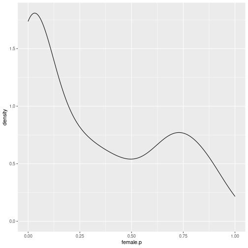
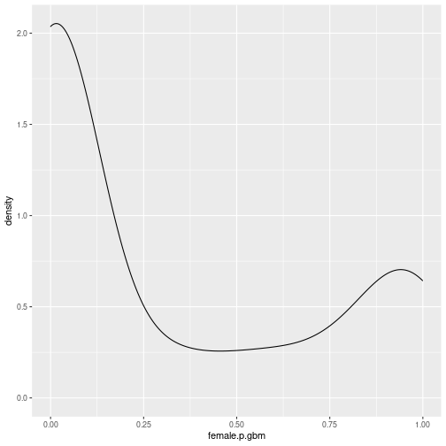
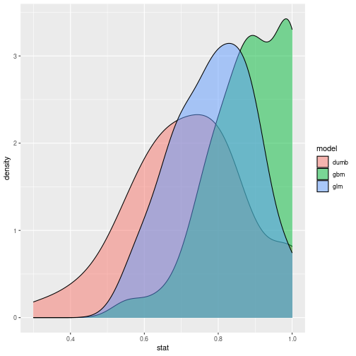
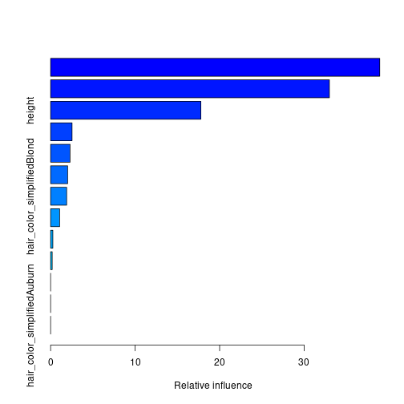

Model Characterization and Selection
========================================================
author: Vincent Toups
date: 11 Sept 2020
width:1400
height:800
css:style.css


Suppose you train a model:
==========================


```r
info
```

```
# A tibble: 489 x 15
      x1 name  gender eye_color race  hair_color height publisher skin_color
   <dbl> <chr> <chr>  <chr>     <chr> <chr>       <dbl> <chr>     <chr>     
 1     0 A-Bo… Male   yellow    Human No Hair       203 Marvel C… -         
 2     1 Abe … Male   blue      Icth… No Hair       191 Dark Hor… blue      
 3     2 Abin… Male   blue      Unga… No Hair       185 DC Comics red       
 4     3 Abom… Male   green     Huma… No Hair       203 Marvel C… -         
 5     5 Abso… Male   blue      Human No Hair       193 Marvel C… -         
 6     7 Adam… Male   blue      Human Blond         185 DC Comics -         
 7     8 Agen… Female blue      -     Blond         173 Marvel C… -         
 8     9 Agen… Male   brown     Human Brown         178 Marvel C… -         
 9    10 Agen… Male   -         -     -             191 Marvel C… -         
10    11 Air-… Male   blue      -     White         188 Marvel C… -         
# … with 479 more rows, and 6 more variables: alignment <chr>, weight <dbl>,
#   female <lgl>, train <lgl>, hair_blond <lgl>, hair_color_simplified <fct>
```


```r
model.glm <- glm(female ~ height + weight + I(height^2) + I(weight^2) + height:weight + hair_color_simplified, info %>% filter(train), family="binomial");
summary(model.glm);
```

```

Call:
glm(formula = female ~ height + weight + I(height^2) + I(weight^2) + 
    height:weight + hair_color_simplified, family = "binomial", 
    data = info %>% filter(train))

Deviance Residuals: 
    Min       1Q   Median       3Q      Max  
-2.0216  -0.5125  -0.0218   0.5053   4.9210  

Coefficients:
                               Estimate Std. Error z value Pr(>|z|)  
(Intercept)                  -9.507e+01  2.036e+03  -0.047   0.9628  
height                        8.850e-01  4.385e-01   2.018   0.0436 *
weight                        8.968e-02  1.061e-01   0.846   0.3978  
I(height^2)                  -2.623e-03  1.406e-03  -1.865   0.0622 .
I(weight^2)                   2.281e-04  9.120e-05   2.502   0.0124 *
hair_color_simplifiedAuburn   2.344e+01  2.035e+03   0.012   0.9908  
hair_color_simplifiedBlack    2.383e+01  2.035e+03   0.012   0.9907  
hair_color_simplifiedBlond    2.471e+01  2.035e+03   0.012   0.9903  
hair_color_simplifiedBrown    2.206e+01  2.035e+03   0.011   0.9914  
hair_color_simplifiedNo Hair  1.134e+00  2.543e+03   0.000   0.9996  
hair_color_simplifiedOther    2.339e+01  2.035e+03   0.011   0.9908  
hair_color_simplifiedRed      2.478e+01  2.035e+03   0.012   0.9903  
hair_color_simplifiedWhite    2.625e+01  2.035e+03   0.013   0.9897  
height:weight                -8.705e-04  7.216e-04  -1.206   0.2276  
---
Signif. codes:  0 '***' 0.001 '**' 0.01 '*' 0.05 '.' 0.1 ' ' 1

(Dispersion parameter for binomial family taken to be 1)

    Null deviance: 301.27  on 248  degrees of freedom
Residual deviance: 163.71  on 235  degrees of freedom
AIC: 191.71

Number of Fisher Scoring iterations: 19
```

***


```r
test <- info %>% filter(!train);
test$female.p <- predict(model.glm, test, type="response");
ggplot(test, aes(female.p)) + geom_density();
```




```r
c(sum((test$female.p>0.5)==test$female)/nrow(test),sum(FALSE==test$female)/nrow(test));
```

```
[1] 0.8166667 0.7166667
```

Suppose you train a model:
==========================


```r
library(gbm);
model.gbm <- gbm(female ~ height +
                     weight +
                     I(height^2) +
                     I(weight^2) +
                     height:weight +
                     hair_color_simplified,
                 distribution="bernoulli",
                 info %>% filter(train),
                 n.trees = 200,
                 interaction.depth = 5,
                 shrinkage=0.1);
summary(model.gbm,plot=FALSE)
```

```
                                        var  rel.inf
weight                               weight 51.96202
hair_color_simplified hair_color_simplified 29.01539
height                               height 19.02259
I(height^2)                     I(height^2)  0.00000
I(weight^2)                     I(weight^2)  0.00000
height:weight                 height:weight  0.00000
```

***




```r
c(sum((test$female.p.gbm>0.5)==test$female)/nrow(test),
  sum((test$female.p>0.5)==test$female)/nrow(test),
  sum(FALSE==test$female)/nrow(test));
```

```
[1] 0.8500000 0.8166667 0.7166667
```

Which Model is Better?
======================


```r
c(sum((test$female.p.gbm>0.5)==test$female)/nrow(test),
  sum((test$female.p>0.5)==test$female)/nrow(test),
  sum(FALSE==test$female)/nrow(test));
```

```
[1] 0.8500000 0.8166667 0.7166667
```

This is an ill-posed question so far - each of the numbers above
depends on the random process of splitting our data set into test and
train sets.

What is the expected value of some model characterization parameter in
the limit of infinite data? What about variation?

Model Selection
===============

This is "model selection." It would be trivial if we had access to an
infinite amount of data (of course, in that case, we'd just train a
neural network or tree based model). But when you have a limited
amount of data it presents challenges.

K-Fold Cross Validation
=======================

1. Take K "folds".
2. set aside 1 of them for testing
3. collect model performance


By Gufosowa - Own work, CC BY-SA 4.0, https://commons.wikimedia.org/w/index.php?curid=82298768

Bootstrapping
=============

Sample from the data with replacement and repeat the modelling process
many times.

By Hand
=======


```r
k_folds <- function(k, data, trainf, statf){
    n <- nrow(data);
    fold_id <- sample(1:k, n, replace=TRUE);
    do.call(rbind, Map(function(fold){
        train <- data %>% filter(fold != fold_id);
        test <- data %>% filter(fold == fold_id);
        model <- trainf(train);
        stat <- statf(model, test);
        tibble(fold=fold, stat=stat);
    },1:k));
}
```

Usage
=====


```r
library(gbm);
n_folds <- 50;
form <- female ~ height +
                     weight +
                     I(height^2) +
                     I(weight^2) +
                     height:weight +
                     hair_color_simplified;
res.glm <- k_folds(n_folds,info,
               function(data){
                   glm(form, data, family="binomial");
               },
               function(model, data){
                   p <- predict(model, data, type="response");
                   sum((p>0.5) == data$female)/nrow(data);
               }) %>% mutate(model="glm");
res.gbm <- k_folds(n_folds,info,
               function(data){
                   gbm(female ~ height +
                     weight +
                     I(height^2) +
                     I(weight^2) +
                     height:weight +
                     hair_color_simplified,
                 distribution="bernoulli",
                 data,
                 n.trees = 200,
                 interaction.depth = 5,
                 shrinkage=0.1);
               },
               function(model, data){
                   p <- predict(model, data, type="response", n.trees=200);
                   sum((p>0.5) == data$female)/nrow(data);
               }) %>% mutate(model="gbm");
res.dumb <- k_folds(n_folds,info,
               function(data){
                   NULL;
               },
               function(model, data){
                   sum(FALSE == data$female)/nrow(data);
               }) %>% mutate(model="dumb");
res <- rbind(res.glm, res.gbm, res.dumb);
```
***

Might be worth the simpler story to use the GLM in this case.

Selection vs Characterization
=============================

So far we've conflated characterization with selection. They are
related, obviously: we want to select the best (characterized) model.

But when we get into the world of R packages, they tend to be
separated.

Enter The Caret
===============

Caret is a package for characterization and tuning.

http://topepo.github.io/caret/index.html

1. It will help you tune parameters of a given model type.
2. It is not as useful for selecting between various models (either
   types or input parameters). It can help you characterize.
   
Caret Example
=============


```r
library(caret);

trainIndex <- createDataPartition(info$female, p = .8, 
                                  list = FALSE, 
                                  times = 1)

info$female <- factor(info$female);

train_ctrl <- trainControl(method = "cv", number = 50);
gbmFit1 <- train(form, data = info %>% slice(trainIndex), 
                 method = "gbm", 
                 trControl = train_ctrl,
                 ## This last option is actually one
                 ## for gbm() that passes through
                 verbose = FALSE)
summary(gbmFit1);
```



```
                                                      var    rel.inf
height:weight                               height:weight 38.9490269
weight                                             weight 32.9915705
height                                             height 17.7727270
hair_color_simplifiedRed         hair_color_simplifiedRed  2.5368971
hair_color_simplifiedBrown     hair_color_simplifiedBrown  2.3079663
hair_color_simplifiedBlack     hair_color_simplifiedBlack  2.0205280
hair_color_simplifiedBlond     hair_color_simplifiedBlond  1.9011542
hair_color_simplifiedOther     hair_color_simplifiedOther  1.0681144
hair_color_simplifiedWhite     hair_color_simplifiedWhite  0.2648281
hair_color_simplifiedNo Hair hair_color_simplifiedNo Hair  0.1871874
I(height^2)                                   I(height^2)  0.0000000
I(weight^2)                                   I(weight^2)  0.0000000
hair_color_simplifiedAuburn   hair_color_simplifiedAuburn  0.0000000
```
***

```r
gbmFit1
```

```
Stochastic Gradient Boosting 

392 samples
  3 predictor
  2 classes: 'FALSE', 'TRUE' 

No pre-processing
Resampling: Cross-Validated (50 fold) 
Summary of sample sizes: 384, 384, 384, 384, 383, 384, ... 
Resampling results across tuning parameters:

  interaction.depth  n.trees  Accuracy   Kappa    
  1                   50      0.8568254  0.6345016
  1                  100      0.8619048  0.6421563
  1                  150      0.8625397  0.6404172
  2                   50      0.8628175  0.6471844
  2                  100      0.8634524  0.6444388
  2                  150      0.8609524  0.6322855
  3                   50      0.8580952  0.6341427
  3                  100      0.8713889  0.6530903
  3                  150      0.8605952  0.6295221

Tuning parameter 'shrinkage' was held constant at a value of 0.1

Tuning parameter 'n.minobsinnode' was held constant at a value of 10
Accuracy was used to select the optimal model using the largest value.
The final values used for the model were n.trees = 100, interaction.depth =
 3, shrinkage = 0.1 and n.minobsinnode = 10.
```

Caret Example GLM
=================


```r
library(caret);

trainIndex <- createDataPartition(info$female, p = .8, 
                                  list = FALSE, 
                                  times = 1)

train_ctrl <- trainControl(method = "cv", number = 50);
glmFit1 <- train(form, data = info %>% slice(trainIndex), 
                 method = "glm",
                 family = "binomial",
                 trControl = train_ctrl)
summary(glmFit1);
```

```

Call:
NULL

Deviance Residuals: 
   Min      1Q  Median      3Q     Max  
 -8.49    0.00    0.00    8.49    8.49  

Coefficients:
                                 Estimate Std. Error    z value Pr(>|z|)    
(Intercept)                    -4.430e+15  5.597e+07  -79155105   <2e-16 ***
height                          3.171e+13  3.803e+05   83391235   <2e-16 ***
weight                          1.060e+13  1.234e+05   85929464   <2e-16 ***
`I(height^2)`                  -2.983e+10  3.468e+02  -86005794   <2e-16 ***
`I(weight^2)`                   3.340e+10  1.692e+02  197341649   <2e-16 ***
hair_color_simplifiedAuburn     7.681e+14  2.888e+07   26597589   <2e-16 ***
hair_color_simplifiedBlack      1.494e+14  1.918e+07    7788941   <2e-16 ***
hair_color_simplifiedBlond     -2.567e+14  1.995e+07  -12864854   <2e-16 ***
hair_color_simplifiedBrown     -1.534e+14  2.002e+07   -7662020   <2e-16 ***
`hair_color_simplifiedNo Hair` -1.177e+14  2.045e+07   -5755884   <2e-16 ***
hair_color_simplifiedOther     -3.319e+13  2.090e+07   -1588080   <2e-16 ***
hair_color_simplifiedRed        5.961e+14  2.150e+07   27722623   <2e-16 ***
hair_color_simplifiedWhite     -1.991e+14  2.464e+07   -8082357   <2e-16 ***
`height:weight`                -1.538e+11  6.965e+02 -220741232   <2e-16 ***
---
Signif. codes:  0 '***' 0.001 '**' 0.01 '*' 0.05 '.' 0.1 ' ' 1

(Dispersion parameter for binomial family taken to be 1)

    Null deviance:  470.86  on 391  degrees of freedom
Residual deviance: 7785.43  on 378  degrees of freedom
AIC: 7813.4

Number of Fisher Scoring iterations: 25
```
***

```r
glmFit1
```

```
Generalized Linear Model 

392 samples
  3 predictor
  2 classes: 'FALSE', 'TRUE' 

No pre-processing
Resampling: Cross-Validated (50 fold) 
Summary of sample sizes: 385, 384, 385, 385, 384, 383, ... 
Resampling results:

  Accuracy   Kappa    
  0.7349603  0.2773742
```

Kappa
=====

"Cohen's kappa measures the agreement between two raters who each classify N items into C mutually exclusive categories...  If the raters are in complete agreement then κ = 1 {\textstyle \kappa =1} {\textstyle \kappa =1}. If there is no agreement among the raters other than what would be expected by chance (as given by pe), κ = 0 {\textstyle \kappa =0} {\textstyle \kappa =0}. It is possible for the statistic to be negative,[6] which implies that there is no effective agreement between the two raters or the agreement is worse than random."

[Cohen's kappa](https://en.wikipedia.org/wiki/Cohen%27s_kappa)

Supported Model Types
=====================

Caret supports a large variety of models beyond GLMs and GBMs. See [the
docs](https://topepo.github.io/caret/index.html).

We've just scratched the surface here.

Model (Parameter) Selection
===========================

A related problem here is what pieces of data we use as predictors in
our model. This is a form of model selection as well.

Caret supports various methods for feature selection. We'll
demonstrate recursive feature elimination:


Via Caret
=========

This turns out to be broken for lmFuncs
```

rfe_ctrl <- rfeControl(functions = lmFuncs, method = "repeatedcv", repeats = 5, verbose = TRUE);

for (nm in names(info)){
    if(is.character(info[[nm]])){
        info[[nm]] <- factor(info[[nm]]);
    }
}

results <- rfe(info %>% slice(trainIndex) %>%
               select(height, weight, hair_color_simplified, alignment) %>% as.data.frame(),
               info %>% slice(trainIndex) %>%
               mutate(female=as.logical(female)*1) %>%
               select(female) %>%               
               `[[`("female"),
               rfeControl=rfe_ctrl);
summary(results);
```

Doing it Ourselves
==================

Pre-treatment:


```r
library(tidyverse);
source("utils.R");
info <- read_csv("./source_data/datasets_26532_33799_heroes_information.csv") %>%
    drop_na() %>% 
    nice_names() %>%
    mutate(female=gender=='Female',
           train=runif(nrow(.))<0.5,
           hair_color = hair_color) %>%
    filter(height > 0 & weight > 0) %>%
    select(-name);
other_rare_elements <- function(values, thresh){
    tbl <- table(values)/length(values);
    values[tbl[values]<thresh] <- "other";
    values;
}
for (nm in names(info)){
    if(is.character(info[[nm]])){
        info[[nm]] <- factor(paste(":",other_rare_elements(info[[nm]],0.2),sep=""));
    }
}
```

The iteration:
==============


```
library(stringr);
colums_of_interest <- c("height","weight","eye_color","skin_color","publisher");
trainIndex <- createDataPartition(info$female, p = .8, 
                                  list = FALSE, 
                                  times = 1)
info$female <- factor(info$female);
extract_var_names <- function(from_gbm){
    Map(function(a){a[[1]]},
        str_split(from_gbm,":")) %>% unlist()
}
results <- do.call(rbind, Map(function(nv){
    train_ctrl <- trainControl(method = "cv", number = 50, verbose=FALSE);
    gbmFit1 <- train(as.formula(sprintf("female ~ %s",
                             paste(colums_of_interest,collapse=" + "))), data = info %>% slice(trainIndex), 
                     method = "gbm",
                     trControl = train_ctrl)
    var.inf <- summary(gbmFit1$finalModel) %>% as_tibble();
    old_coi <- paste(colums_of_interest,collapse=" + ");
    colums_of_interest <<- extract_var_names(var.inf$var[1:nv]);
    tibble(n_variables=nv, accuracy=max(gbmFit1$results$Accuracy),
           variables=old_coi);
},seq(from=length(colums_of_interest)-1,to=1,by=-1)));
results;
```


```
# A tibble: 4 x 3
  n_variables accuracy variables                                           
        <dbl>    <dbl> <chr>                                               
1           4    0.893 height + weight + eye_color + skin_color + publisher
2           3    0.892 weight + height + eye_color + publisher             
3           2    0.884 weight + height + eye_color                         
4           1    0.886 weight + height                                     
```

Conclusions
===========

Models are themselves random objects that depend on the selection of
training and testing data.

Thus, we must find a way to estimate their expected properties if we
are to characterize them accurately.

The methods typically used (if access to arbitarily large test data is
not available) are:

1. Cross Validation
   Hold out N samples repeatedly in "folds", train and characterize the model.
2. Bootstrapping Draw repeatedly from the data set and then split the
   results into train and test sets. Train your model and calculate
   the statistics.
   
These simple descriptions somewhat understand the complexity of the
issues involved.

   
