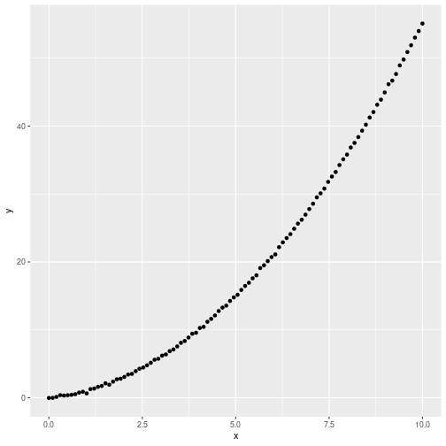

Misc Topics & Python
====================
author: Vincent Toups
date: 11 Sept 2020
width:1400
height:800
css:style.css

1. A Little More Caret
2. Optimization Overview
3. Python Introduction

Caret and RFE
=============

Last week we discussed using Caret to do recursive feature
elimination. 

The example I used didn't quite work, however (the lmFunctions was
broken) and some of you may want to do RVE with a different metric
than Accuracy.

Recap
=====

1. Caret is a library which helps us do model characterization and
   selection. 
2. Many models supported by Caret do not require explicit feature
   selection because they perform this function for us in one way or
   another.
3. For those that do not we can use the `rfe` function to do recursive
   feature elimination. This supports a smaller number of methods.
   
Options for GLMs.
=================

If you want to do a feature selection task for a GLM you can use
"glmStepAIC"


```r
glm_fit;
```

```
Generalized Linear Model with Stepwise Feature Selection 

114 samples
 11 predictor
  2 classes: 'Female', 'Male' 

Pre-processing: centered (8), scaled (8), ignore (3) 
Resampling: Cross-Validated (5 fold, repeated 5 times) 
Summary of sample sizes: 91, 91, 91, 92, 91, 92, ... 
Resampling results:

  ROC        Sens   Spec     
  0.7094883  0.192  0.9185965
```
***

```r
## ...
##             Df Deviance     AIC
## - power      1   82.735  96.735
## <none>           81.283  97.283
## - weight     1   85.907  99.907
## - speed      1   86.040 100.040
## - eye_color  3   93.386 103.386
## - height     1   96.521 110.521

## Step:  AIC=96.74
## .outcome ~ eye_color + weight + height + speed

##             Df Deviance     AIC
## <none>           82.735  96.735
## - speed      1   86.290  98.290
## - weight     1   86.661  98.661
## - eye_color  3   94.004 102.004
## - height     1   96.593 108.593
## There were 50 or more warnings (use warnings() to see the first 50)
summary(glm_fit);
```

```

Call:
NULL

Deviance Residuals: 
    Min       1Q   Median       3Q      Max  
-2.0927   0.1831   0.3592   0.5573   2.0132  

Coefficients:
               Estimate Std. Error z value Pr(>|z|)    
(Intercept)      1.8903     0.4419   4.278 1.89e-05 ***
eye_colorbrown   0.7926     0.8483   0.934  0.35018    
eye_colorgreen  -1.7183     0.6947  -2.474  0.01338 *  
eye_colorother   1.2194     1.1919   1.023  0.30628    
weight          -1.0683     0.4884  -2.187  0.02871 *  
height           1.6486     0.5067   3.254  0.00114 ** 
speed            0.7069     0.4115   1.718  0.08583 .  
---
Signif. codes:  0 '***' 0.001 '**' 0.01 '*' 0.05 '.' 0.1 ' ' 1

(Dispersion parameter for binomial family taken to be 1)

    Null deviance: 108.920  on 113  degrees of freedom
Residual deviance:  82.735  on 107  degrees of freedom
AIC: 96.735

Number of Fisher Scoring iterations: 6
```

Using F1 Instead of ROC
=======================

To use a different metric we need to define a new summary function. We
can just add an F1 Score to the build in function:

(NB - we can get the source code for most R functions by just
mentioning it on the command line).


```r
twoClassSummary
```

```
function (data, lev = NULL, model = NULL) 
{
    if (length(lev) > 2) {
        stop(paste("Your outcome has", length(lev), "levels. The twoClassSummary() function isn't appropriate."))
    }
    requireNamespaceQuietStop("pROC")
    if (!all(levels(data[, "pred"]) == lev)) {
        stop("levels of observed and predicted data do not match")
    }
    rocObject <- try(pROC::roc(data$obs, data[, lev[1]], direction = ">", 
        quiet = TRUE), silent = TRUE)
    rocAUC <- if (inherits(rocObject, "try-error")) 
        NA
    else rocObject$auc
    out <- c(rocAUC, sensitivity(data[, "pred"], data[, "obs"], 
        lev[1]), specificity(data[, "pred"], data[, "obs"], lev[2]))
    names(out) <- c("ROC", "Sens", "Spec")
    out
}
<bytecode: 0x55c1dd909d10>
<environment: namespace:caret>
```

So...
=====


```r
library(MLmetrics);
f1_summary <- function (data, lev = NULL, model = NULL) 
{
    if (length(lev) > 2) {
        stop(paste("Your outcome has", length(lev), "levels. The twoClassSummary() function isn't appropriate."))
    }
    caret:::requireNamespaceQuietStop("pROC")
    if (!all(levels(data[, "pred"]) == lev)) {
        stop("levels of observed and predicted data do not match")
    }
    rocObject <- try(pROC::roc(data$obs, data[, lev[1]], direction = ">", 
        quiet = TRUE), silent = TRUE)
    rocAUC <- if (inherits(rocObject, "try-error")) 
        NA
    else rocObject$auc
    
    out <- c(rocAUC,
             sensitivity(data[, "pred"], data[, "obs"], lev[1]),
             specificity(data[, "pred"], data[, "obs"], lev[2]),
             MLmetrics::F1_Score(data[, "obs"], data[, "pred"], "Female"));
    names(out) <- c("ROC", "Sens", "Spec","F1");
    out
}
```

And We Use It Thus
==================


```
objControl <- trainControl(method = 'repeatedcv', 
                         number = 5, 
                         repeats = 5, 
                         summaryFunction = f1_summary, 
                         classProbs = TRUE)
glm_fit <- invisible(train(dataset[,predictors], dataset$gender,
                 method='glmStepAIC', 
                 verbose = TRUE,
                 trControl = objControl,  
                 metric = "F1",
                 preProc = c("center", "scale"),
                 train.fraction = 0.5));
glm_fit
```

```r
glm_fit
```

```
Generalized Linear Model with Stepwise Feature Selection 

114 samples
 11 predictor
  2 classes: 'Female', 'Male' 

Pre-processing: centered (8), scaled (8), ignore (3) 
Resampling: Cross-Validated (5 fold, repeated 5 times) 
Summary of sample sizes: 92, 91, 91, 91, 91, 91, ... 
Resampling results:

  ROC        Sens   Spec       F1       
  0.6879298  0.204  0.9312281  0.3792717
```

Nota Bene 1
===========

Our discrete variables have been one hot encoded. That is, each factor
variable is converted into N dimensions where N is the number of
levels. We don't have much choice since these variables aren't
ordered.

But this does (weakly) introduce correlated variables into our model:
if `eye_colorGreen` is 1 then we know that all other `eye_color`
variables are 0. 

Nota Bene
=========

glmStepAIC uses the Akaiki Information Criterion to select features
rather than the metric we pass to the train function. We'd need to
implement even more custom code to modify the metric used for feature
selection.

This is a log-likelihood penalized by a factor proportional to the
number of degrees of freedom in the model.

Ridge Regression & Lasso
========================


Background
==========

Whether we do classification or regression we are looking for a model
which minimizes the sum of squared errors: 

```
min(sum((y-y_pred)*(y-y_pred)))
```

Where (in a linear model) each `y_pred` is given by:

```
b0 + b . x
```

That is, each `y_pred` is a weighted sum of the predictors plus some
offset term.

If (for some reason) a component of b were 0 that would amount to
eliminating it from the model. What if we forced components to be
zero?

Ridge Regression & Lasso
========================


This is an example of regularization, which we'll see appear again if
we discuss neural networks. Restricting your degrees of freedom helps
keep you from overfitting.

Lasso is better than Ridge Regression because it forces some
predictors entirely to zero. You may want to threshold if you use
Ridge Regression.

glmnet: linear mixture of LASSO and Ridge
=========================================

[Introduction to GLMNET](https://web.stanford.edu/~hastie/glmnet/glmnet_alpha.html)

[](./images/glmnet-obj-function.png)

```

predictors <- names(dataset) %without% c("name",
                                         "gender",
                                         "total");

form <- as.formula(sprintf("gender ~ %s", paste(predictors, collapse="+")));

objControl <- trainControl(method = 'repeatedcv', 
                         number = 5, 
                         repeats = 5, 
                         summaryFunction = twoClassSummary, 
                         classProbs = TRUE)


glm_fit <- invisible(train(form, data=dataset,
                 method='glmnet', 
                 verbose = TRUE,
                 trControl = objControl,  
                 metric = "ROC",
                 preProc = c("center", "scale"),
                 train.fraction = 0.5));
```
***


```r
glm_fit
```

```
glmnet 

114 samples
 11 predictor
  2 classes: 'Female', 'Male' 

Pre-processing: centered (18), scaled (18) 
Resampling: Cross-Validated (5 fold, repeated 5 times) 
Summary of sample sizes: 91, 92, 91, 91, 91, 91, ... 
Resampling results across tuning parameters:

  alpha  lambda        ROC        Sens   Spec     
  0.10   0.0002198918  0.6175380  0.226  0.8825731
  0.10   0.0021989181  0.6170380  0.226  0.8824561
  0.10   0.0219891807  0.6369181  0.134  0.9228070
  0.55   0.0002198918  0.6195322  0.226  0.8825731
  0.55   0.0021989181  0.6250029  0.236  0.8867836
  0.55   0.0219891807  0.6686140  0.142  0.9443275
  1.00   0.0002198918  0.6218363  0.226  0.8846784
  1.00   0.0021989181  0.6313538  0.236  0.8909942
  1.00   0.0219891807  0.7073158  0.124  0.9573099

ROC was used to select the optimal model using the largest value.
The final values used for the model were alpha = 1 and lambda = 0.02198918.
```

Optimization In General
=======================

1. Modeling is always defined in terms of an underlying optimizatin task. 
2. Luckily, smart people have spent a great deal of time on this problem
3. But it is worth thinking a little about

***


```r
library(tidyverse);
x <- seq(from=0, to=10, length.out=100);
exd <- tibble(x=x, y=0.5*x + 0.5*x*x + 0.1*rnorm(length(x)));
ggplot(exd, aes(x,y)) + geom_point();
```



Imagine fitting this function - we can guess its a degree two
polynomial with 0 intercept, say, but we still have two parameters to
choose. Call then a and b.

Guessing Randomly
=================


```r
rms <- function(a,b,tbl){
    d <- tbl$y - (a*tbl$x + b*tbl$x*tbl$x);
    sum(d*d)
}
results <- tibble(a=runif(1000,0,1),b=runif(1000,0,1)) %>% rowwise() %>%
    mutate(error=rms(a,b,exd)) %>% ungroup();
ggplot(results, aes(a,b)) + geom_point(aes(color=error)) +
    geom_point(data=results %>% arrange(error) %>% head(10), color="red");
```


***


```r
results %>% arrange(error) %>% head(10)
```

```
# A tibble: 10 x 3
       a     b error
   <dbl> <dbl> <dbl>
 1 0.515 0.500  1.83
 2 0.377 0.518  5.79
 3 0.440 0.503  6.32
 4 0.315 0.524  8.70
 5 0.306 0.524  9.38
 6 0.464 0.498 12.7 
 7 0.472 0.496 13.1 
 8 0.509 0.508 14.5 
 9 0.342 0.527 15.2 
10 0.463 0.496 16.9 
```
 Not that good!

Optim
=====

```
?optim
optim                  package:stats                   R Documentation

General-purpose Optimization

Description:

     General-purpose optimization based on Nelder-Mead, quasi-Newton
     and conjugate-gradient algorithms. It includes an option for
     box-constrained optimization and simulated annealing.

Usage:

     optim(par, fn, gr = NULL, ...,
           method = c("Nelder-Mead", "BFGS", "CG", "L-BFGS-B", "SANN",
                      "Brent"),
           lower = -Inf, upper = Inf,
           control = list(), hessian = FALSE)
     
     optimHess(par, fn, gr = NULL, ..., control = list())
     
Arguments:

     par: Initial values for the parameters to be optimized over.

      fn: A function to be minimized (or maximized), with first
          argument the vector of parameters over which minimization is
          to take place.  It should return a scalar result.

      gr: A function to return the gradient for the ‘"BFGS"’, ‘"CG"’
          and ‘"L-BFGS-B"’ methods.  If it is ‘NULL’, a
          finite-difference approximation will be used.

          For the ‘"SANN"’ method it specifies a function to generate a
          new candidate point.  If it is ‘NULL’ a default Gaussian
          Markov kernel is used.

     ...: Further arguments to be passed to ‘fn’ and ‘gr’.
```

Using It
========


```r
optim(runif(2), # a random guess
      function(v){
          rms(v[1],v[2],exd);
      },
      gr=NULL);
```

```
$par
[1] 0.5031628 0.5000922

$value
[1] 1.188101

$counts
function gradient 
      75       NA 

$convergence
[1] 0

$message
NULL
```

Note that we only called our error function ~50 times! This is a huge
improvement of 1000.

Gradient Descent
================


By Gradient_descent.png: The original uploader was Olegalexandrov at English Wikipedia.derivative work: Zerodamage - This file was derived from:  Gradient descent.png:, Public Domain, https://commons.wikimedia.org/w/index.php?curid=20569355

***

"Always go downhill." The hill is our error function.

Limitations and Variations
==========================

Gradient descent finds the _local_ minimum. To improve robustnes lots
of elements are added: descenders with momentum, decreasing step size,
multiple descenders that push on eachother etc.

Optimization is a field unto itself and luckily we usually don't care
too much about the details as data scientists.

In the end the important questions are: how does my model behave, does
it overfit, what are the costs associated with different sorts of
errors? What does my model _mean_?

