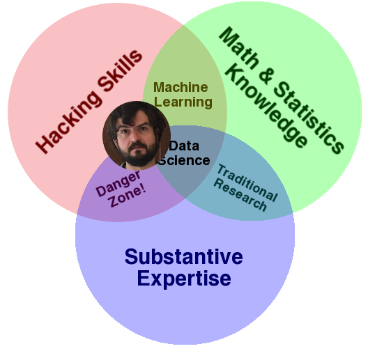
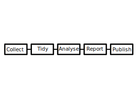
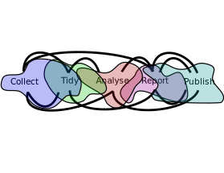
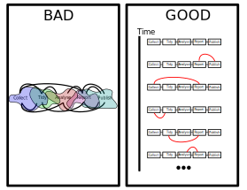

========================================================
Introduction to the Course
--------------------------

Introduction to Datascience
========================================================
What is a Datascientist?
------------------------

"A datascientist is what you get when you take a statistician and remove reason
and accountability."

***

<small>
This is a mean way of saying that many data scientists come fron
non-statistical backgrounds and operate under circumstances where
rigor is not the top priority.

You all are lucky: you have the statistical foundation to be good data
scientists but may not have the technical background to navigate all the
tools of the trade that host and enable your work. 

This course's job is to introduce those tools to you.
</small>

What is a Data Scientist?
========================================================

http://drewconway.com/zia/2013/3/26/the-data-science-venn-diagram

What is a Data Scientist?
========================================================

http://drewconway.com/zia/2013/3/26/the-data-science-venn-diagram

There are things about statistics you will surely be shocked I don't know.

Tasks data scientists do:
========================================================

1. Visualization
2. Exploratory Data Analysis
3. ETL (Extract, Transform, Load)
4. Application Development
5. Operations (setting up pipelines between databases and models)
6. Orchestrating Data Collection Standards
7. Lots else.

Data Science Project Lifetime
=============================

Science is the orderly passage through this graph:

...

Data Science Project Lifetime
=============================

Science is the dis-orderly passage through this graph:

Good Data Science
=================

Elaboration
===========

We want to convert an ad-hoc, disordered, process into one in which
each phase is represented and each change is recorded along with
meaningful context.

Goofus
======

<small>
Goofus Presents Preliminary Results at BIOCON 2019 and publishes a
paper in 2021. A colleague asks why a large p-value (reported in 2019)
is much smaller in 2021.

Goofus just has a folder on his hard drive with a giant notebook in
it. He has a backup from late 2019 but has no idea what of the many
changes he has made since then changed the p-value. Also, he doesn't
have previous data set - having replaced it with an updated one.

</small>
***

Gallant
=======

<small>
Gallant presented at the same conference and published in 2021 as
well. He also had a p value reach significance between presentation
and publication. 

When Gallant is asked about it, she (her first name is Alice) is able
to time travel back into her git repository and re-run her analysis to
reproduce the presentation result. She then writes a `git-bisect`
script and finds the exact commit where her p-value changed. The
commit message says "Modified outlier elimination to remove bad data
from this study."  She can provide a definitive answer!

</small>
***

Not Just Version Control
========================

By far the most useful tool you'll learn here is Git. 

But you will also need these tools to make your work _really
reproducible_:

1. Unix Skills - tie everything together
2. Programming Skills - R and Python and Shell
3. Docker - reproducible development environments
4. Make - reproducible builds

Non-Tools
=========

Jupyter/RMarkdown

These are ok tools for exploratory work and quick write ups. I
encourage you to use them if you'd like. These slides are RMarkdown.

But they are bad tools for reproducible data science.

***

1. They obscure dependencies
2. They maintain a lot of global state
3. They discourage "factoring"
4. They pose a modest technical lock in 
5. They don't play well with git
6. They interleave _reporting_ with _processing_ and these are
   fundamentally disjoint tasks.
   
Analysis
========

While I'm hardly a statistician and you all probably know more than I
do, we will also cover:

1. Exploratory Data Analysis in R and Python
2. Processing, Joining and Cleaning Data
3. Visualization
4. Modeling (clustering, classification)

Things To Do Before Next Class
==============================

<small>
Visit these sites:

https://www.kaggle.com/
https://teddit.net/r/datasets

(teddit is a mirror of reddit that is more usuable)

https://duckduckgo.com/?q=open+data+sets&t=newext&atb=v234-1&ia=web

</small>

Things to Try Before Next Class
===============================

<small>
1. Get a docker environment running. You should be able to do this in
   Windows or Linux or Mac. 
   https://docs.docker.com/get-started/
   On windows you can install Docker directly or install a Linux virtual
   Machine via Virtualbox. The latter is a bit more heavyweight a
   solution but will make your life easier in the long run.
    
2. Run a rocker/verse image.
   `docker run -e PASSWORD=yourpassword --rm -p 8787:8787 rocker/rstudio`
</small>

Course Material
===============

Located here:

https://github.com/Vincent-Toups/datasci611

Homework
========

1. Pick a data set you might find interesting.

2. Write a pitch for your analysis (~500 words). What do you hope to
learn by looking at it in detail?

