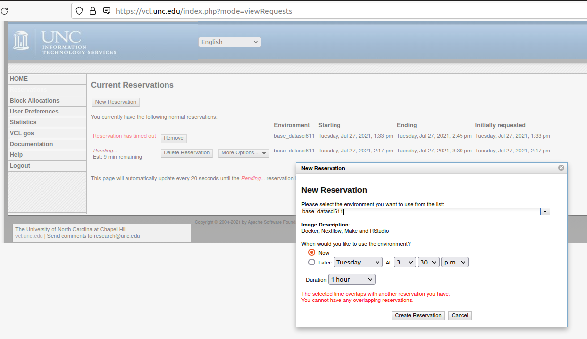
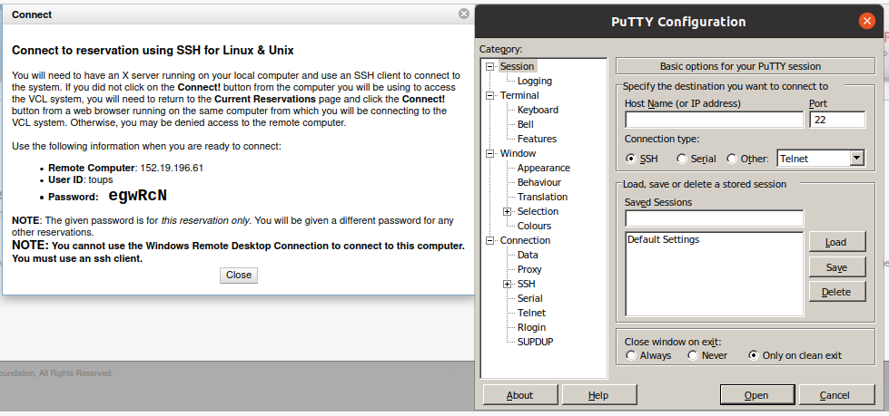
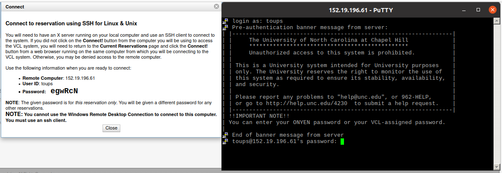

VCL: Compute Resources
========================================================
author: Vincent Toups
date: 22 Jul 2021
autosize: true

Fair Warning
========================================================

***

UNC's VCL (virtual computer lab) will provide you with the basic computing
resources you need to complete this course but it won't really do so
comfortably.

I highly recommend that you set up Docker on your local machine. For Windows
users the easiest way to do this is to set up Docker for Windows but the best
way is installing Docker with Windows Subsystem for Linux (2).
https://docs.docker.com/docker-for-windows/wsl/

Pre-requisites
========================================================

1. UNC Onyen
2. Windows: Either Putty or Cygwin
3. Linux or Mac: All Set Already

What is The UNC VCL
========================================================

The UNC VCL is a way for you to spin up a Unix (Linux) shell. 

Why we need it
==============

At least half of this course is about tools and all the tools are best used
from a unix-flavored command line (which we will cover in subsequent lectures).

Docker is both more comfortable with a unix system as its host and also does
better _hosting_ unix systems. Because Docker is critical to doing really 
portable data science its best to just bite the bullet and jump in.

VCL will provide any UNC student with a command line which can run 
Docker from which you can host your projects.

The VCL
=======

Putty
=====

Terminal
========

